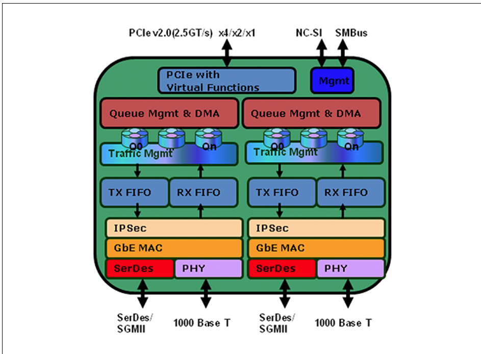

# IGB 网卡驱动

## 资料

[qemu igb文档](https://www.qemu.org/docs/master/system/devices/igb.html)

[igb网卡文档](https://www.intel.com/content/dam/www/public/us/en/documents/datasheets/82576eg-gbe-datasheet.pdf)

[linux igb驱动](https://github.com/torvalds/linux/tree/master/drivers/net/ethernet/intel/igb)

## 硬件架构

CPU集成MAC:

网卡包含MAC和PHY:

IGB网卡架构:

