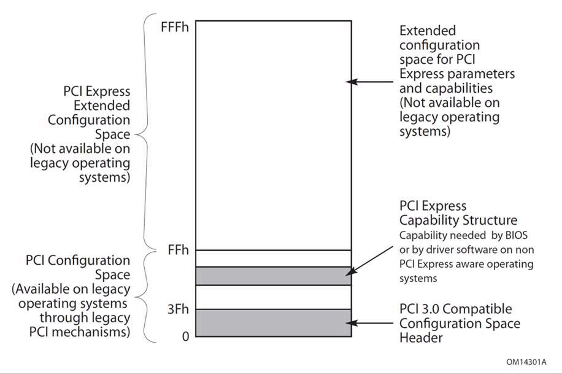
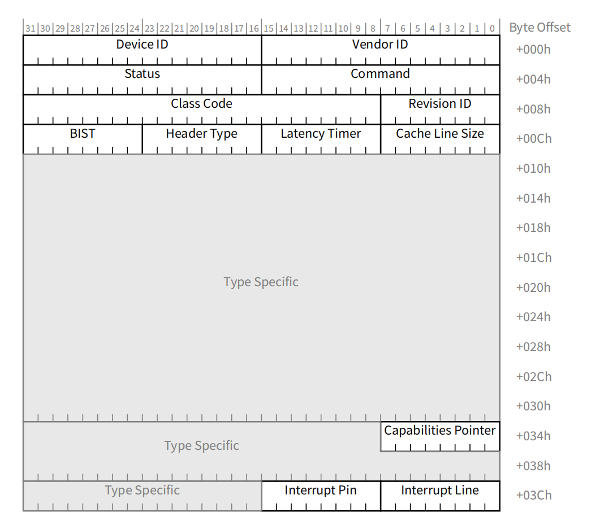

# PCIe基础知识

## 课程概述

本课程将介绍PCIe（Peripheral Component Interconnect Express）的基本知识，包括配置空间、地址空间、深度优先遍历等核心概念。

---

## 1. PCIe简介

### 1.1 什么是PCIe

- PCIe是一种高速串行总线标准
- 替代了传统的PCI总线
- 采用点对点连接，支持全双工通信
- 具有更高的带宽和更好的扩展性

### 1.2 PCIe的主要特点

- **串行传输**：相比PCI的并行传输，减少了信号干扰
- **分层架构**：物理层、数据链路层、事务层
- **热插拔支持**：支持设备的热插拔操作
- **向下兼容**：软件层面兼容PCI

---

## 2. PCIe配置空间

### 2.1 配置空间概述

PCIe配置空间是用于存储设备配置信息的内存区域，每个PCIe设备都有自己的配置空间。

### 2.2 配置空间结构

配置空间大小：4KB（4096字节）



标准配置头



### 2.3 重要寄存器详解

#### 2.3.1 Base Address Registers (BARs)

- **作用**：定义设备的内存或I/O地址空间
- **位置**：0x10-0x27（6个BAR寄存器）
- **类型**：
  - 内存BAR：用于内存映射I/O
  - I/O BAR：用于端口映射I/O

#### 2.3.2 Capabilities Pointer

- **作用**：指向第一个能力结构的偏移地址
- **格式**：链表结构，每个能力包含下一个能力的指针

### 2.4 配置空间访问方法

1. **端口访问**：使用0xCF8和0xCFC端口
2. **内存映射访问**：通过MMCONFIG机制
3. **ECAM（Enhanced Configuration Access Mechanism）**

---

## 3. PCIe地址空间

### 3.1 地址空间类型

#### 3.1.1 内存地址空间

- **32位内存空间**：0x00000000 - 0xFFFFFFFF
- **64位内存空间**：支持64位地址
- **预取特性**：可标记为可预取或不可预取

#### 3.1.2 I/O地址空间

- **大小**：16位地址空间（0x0000-0xFFFF）
- **用途**：传统I/O端口访问
- **限制**：现代设备较少使用

#### 3.1.3 配置地址空间

- **每个设备**：4KB配置空间
- **访问方式**：通过配置事务

### 3.2 内存映射示例

---

## 4. PCIe深度优先遍历

### 4.1 PCIe拓扑结构

### 4.2 总线编号机制

- **主总线号**：上游总线号
- **次总线号**：下游总线号
- **从属总线号**：子树中的最大总线号

### 4.3 深度优先遍历算法

#### 4.3.1 遍历伪代码

```
function enumerate_pci_bus(bus_number):
    for device = 0 to 31:
        if device_exists(bus_number, device):
            for function = 0 to 7:
                if function_exists(bus_number, device, function):
                    process_device(bus_number, device, function)
                    
                    if is_bridge(bus_number, device, function):
                        secondary_bus = get_secondary_bus(bus_number, device, function)
                        enumerate_pci_bus(secondary_bus)  // 递归调用
```

#### 4.3.2 实现示例

### 4.4 遍历过程详解

#### 4.4.1 遍历步骤

1. **从根总线开始**：通常从总线0开始
2. **扫描设备**：遍历每个可能的设备号（0-31）
3. **检查功能**：对每个设备检查所有功能（0-7）
4. **识别桥设备**：通过Header Type识别桥设备
5. **递归遍历**：对桥设备的下游总线进行递归遍历

#### 4.4.2 设备识别流程

读取Vendor ID → 检查是否为0xFFFF → 存在则处理设备 → 检查Header Type → 
如果是桥设备则递归遍历子总线

